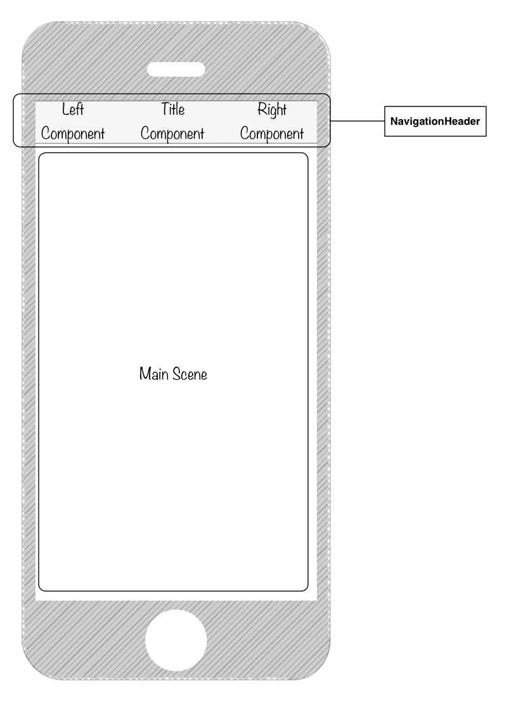

> 具体实现参照：[UiLibrary/Navigator](https://github.com/plusmancn/im-client/tree/master/UiLibrary/Navigator)

**标示图**  


下面讲讲实现过程中思考过的几个问题
## 路由模式
**Q: 每个视图是否需要像 Web 一样有一个路由表？**  
这是从用户使用习惯的一个考虑。观察传统的 `Web` 网页，很少有真正意义上的返回概念，大概是因为在 `PC` 时代，屏幕足够大，能够容纳足够多的导航信息，用户基本都是点哪进哪，导致用户的浏览轨迹没有一个稳定的路径， 所以开发去关心上一页是什么状态，也便没有了什么意义。这种情况下，有一个涵盖所有页面的路由表，能够快速的在页面之间进行切换，能够极大提升开发效率，简化开发流程。  
回到移动端 `App` 的导航模式，它类似 `树状结构`，一个功能线类似一个树枝，切换到一个功能需要先回到主干，再进入到另一个树枝，不会纵横交错。
这里有一个使用细节，在 `App` 中，你返回上一个页面的时候，上个页面的状态是被保留，为了实现这个特性，应用会保留一个导航栈，导航栈的大小多少会影响到应用的性能，这也侧面导致 `App` 的导航不能无限延伸。  
`rn` 生来还是为了做移动端 `App` 的，还是要遵循移动端用户习惯，反应到技术实现上，一个全局的路由表并没有很大意义，既然是导航栈，那么 `push/pop` 装卸视图，会更加契合。

## TabBar 和 Navigator 的关系
`TabBar` 是 `Navigator` 的第一个路由，位于栈底，只要导航栈在，那么 `TabBar` 就永远不会被销毁，就可以保留各种组件状态，比如滑动位置、输入状态。  
对于 `Navigator` 来说，一个 `TabBar` 就是第一个 `Main Scene` 罢了，和其他 `Main Scene` 视图没有区别。  
`TabBar` 由于本身又实现了多个横向的导航，自带缓存机制。

基于此，一个经典的 `TabBar` + `Navigator` 的导航模式就出来了。  

## route 配置上改放哪些属性
`NavigationCardStack` 把导航栈的数据结构开放给了开发者，通过改变导航栈，进而触发视图变更，基础定义如下：
```javascript
{
    index: 0, // 代表当前的显示的是哪个路由。
    // 路由视图的配置信息
    routes: [
        {
            key: '0', // 路由唯一键值
            title: '' // 如果自定义 NavigationHeader 的 renderTitleComponent 属性，
            // 默认控件会去取 title 的属性值
        }
    ]
}
```
自定义导航组件的设计中，在每个 `Main Scene` 内部的组件，会在组件的 `props` 属性上添加 `navigator` 实例对象，用于访问当前所处的 `Navigator` 组件实例。  
通过该实例，可以设置导航栏状态等，比如我们在该实例上开放了一个 `setRenderRightCompoent` 方法，用于设置 `RenderRightCompoent`。  
这个时候，我们碰到一个问题，`RightComponent` 属性究竟需不需要放到 `route` 配置上去，例如  
```javascript
{
    key: '1',
    title: 'blabla',
    RenderRightCompoent: function () {}
}
```
由于 `routes` 定义绑定在 `state` 上，更新 `RenderRightCompoent`，会触发新一轮的 `render`，这样可以保证最新的 `RightCompoent` 会被渲染出来。  
虽然这里的关键点是把发生变更的属性反应到 `state` 上，但是，把 `RenderRightCompoent` 放置到路由上，数据结构上回更加清晰。  
无需担心 `route` 变量各处传递，会占用更多内存，因为对于对象，这只是个引用而已。  
所以这里的原则是，需要实时更新的相关联组件，放到 `route`，放到 `state` 里面去。  
无需实时更新的组件，比如主视图的堆栈，可以考虑单独维护一个数组，脱离 `state`，以提高性能。  

这里还有个  `NavigationCardStack` 渲染时机的小知识，`renderScene`  方法是比 `header` 渲染先执行的，基于此，我们可以在 `Main Scene` 内组件的  `componentWillMount` 方法上，设置导航栏属性，以此减少重复渲染。

## 组件之间交互问题。
在示例项目中，`RightComponent`，是一个保存按钮，`Man Scene` 里面有一个输入框，只有当输入框有值的时候，保存按钮为可用状态。  
示例的实现是返回了一个 `RightComponent` 的 `ref` 引用，通过调用应用的 `setState` 来更新按钮状态。

还有一种实现方式是，利用事件来传递状态，不做展开，因为光 `EventEmitter` 模块选型就可以单独写一大篇文章。

更高级的封装实现，可以考虑 `mobx`，`redux` 等数据流管理架构。

## 视图渲染频率控制
可以考虑利用静态容器，来控制渲染频率，当前组件的控制策略是，只在组件状态从（unActive -> Active）时渲染。  
👇 是我的回答，关于重复渲染的问题  
[Component rendered twice when using NavigationExperimental (NavigationCardStack)](https://github.com/facebook/react-native/issues/10835#issuecomment-282565796)
