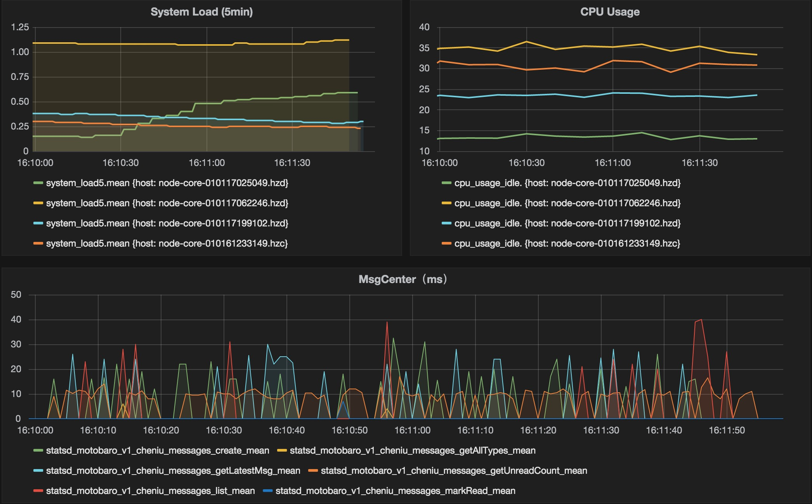

古语：“知己知彼，百战不殆”，面对性能优化，哪怕不求百战不殆，也求“死得明白”，所以在尝试进行系统性能优化之前，先得了解系统的性能瓶颈在哪，不至于使不上劲。

> 我不生产知识，只是知识的搬运工，都是团队实践的总结。

<!-- more -->

## 监控选型：Grafana + Telegraf + InfluxDB
选型是团队的架构湿安叔做的，考虑到数据实时性和灵活性，选择了[Grafana](http://grafana.org/)（下文简称Gra）  和 [InfluxDB](https://influxdata.com/)（下文简称Inf）， 与 [oneapm](http://www.oneapm.com/) 互补。
* Inf是 time-series data 类型的数据库，支持类sql语句查询，适合监控数据存储，实时分析。
* [Telegraf](https://influxdata.com/time-series-platform/telegraf/) 是安装于生产机的守护进程，用于埋点数据收集并转发到Gra数据库，并收集宿主机负载信息
* Gra 用作数据呈现，封面截图就来自Gra

实践环境：
* node v4.2.3
* Ubuntu 14.04，15.04
* Express v3.4.7 ~ v4.13.3

## step1：安装InfluxDB
1）下载和安装
传送[InfluxDB - Database Download](https://influxdata.com/downloads/)，直接找到 Ubuntu & Debian 章节，按照提示安装，相比于apt-get方法，此法在国内特殊环境下靠谱些。
2）启动：
```
sudo service influxdb start
```
3）检查服务是否启动
```
sudo netstat -apn | grep 8086
```
看到如下结果，代表启动正常
```
tcp6  0  0 :::8086    :::*   LISTEN  1746/influxd
```

## step2：安装Telegraf
1）下载和安装
传送[Telegraf - Data Collector Download](https://influxdata.com/downloads/#telegraf)，通InfluxDB，按照提示安装即可。
2）配置文件
安装完成后，Linux debian and RPM packages 的配置文件位置在 `/etc/opt/telegraf/telegraf.conf`
打开文件后，发现 SERVICE PLUGINS 是空的，我们需要安装 [statsd](https://github.com/influxdata/telegraf/tree/master/plugins/statsd)，Telegraf 命令的位置在 `/opt/telegraf/telegraf`
执行
```
/opt/telegraf/telegraf -usage statsd
```
输出
```
# Statsd Server
[[plugins.statsd]]
  # Address and port to host UDP listener on
  service_address = ":8125"
  # Delete gauges every interval (default=false)
  delete_gauges = false
  # Delete counters every interval (default=false)
  delete_counters = false
  # Delete sets every interval (default=false)
  delete_sets = false
  # Delete timings & histograms every interval (default=true)
  delete_timings = true
  # Percentiles to calculate for timing & histogram stats
  percentiles = [90]

  # templates = [
  #     "cpu.* measurement*"
  # ]

  # Number of UDP messages allowed to queue up, once filled,
  # the statsd server will start dropping packets
  allowed_pending_messages = 10000

  # Number of timing/histogram values to track per-measurement in the
  # calculation of percentiles. Raising this limit increases the accuracy
  # of percentiles but also increases the memory usage and cpu time.
  percentile_limit = 1000
```
将配置示例复制到 SERVICE PLUGINS 下方。
statsd 允许其他应用通过udp的方式，以特定语法向Telegraf传递应用数据。
3）开启服务
```
sudo service telegraf start
```
4）检查服务
```
sudo netstat -apn | grep 8125
```
输出如下，代表启动正常
```
udp6  0  0 :::8125   :::*  2696/telegraf
```

## step3： 应用埋点-以 Express 为示例
> 应用埋点，其实就是向Telegraf的Statsd服务发送数据包，端口是8125

在需找中间件的过程中，发现了 [Uber express-statsd](https://github.com/uber/express-statsd)，README.md 内给出了一种埋点方法  [传送门](https://github.com/uber/express-statsd#per-route-example)
推荐的方法是在路由定义时就需要确定这个API对应的Key，但是实际情况是，我参与的项目已经有几十万行的代码量，大量路由已经定义过，不可能再去动这些路由。
当时尝试的第一种方式，req.statsdKey 为 req.url，然而url是动态的，随便加个参数就不同了，会产生大量无用key，而且并没有按照API进行有效的聚合，尤其是GET类型的请求。
尝试的的第二种方式，req.path 为 key，但是碰到 path url 样式的路由就会和 req.url 发生一样的状况，例如 `/get/user/:id`。
接着尝试第三种方式
先脱离Express，回到最基础 node 内置模块 http，以前我们要开启一个http服务器，会这样书写
```
'use strict';
var http = require('http');

http.createServer(function(req,res){
  res.writeHead(200,{'Content-Type':'text/html; charset=utf-8'});
  /**
    中间对URL做判断，输出不同结果；判断的过程其实就是Express的route
  */
  res.end(req.url + ' at time ' + Date.now() + ' \n');
}).listen(9002);
```
所以，`var app = express()`，如果去看app的类型，其实就是个Function，我们在app上绑定上一堆中间件后，最后会执行这么一句
```
http.createServer(app).listen(PORT);
```
所以尝试把焦点放到 Express 的路由机制上，假设 Express 最后处理了一个请求并且有返回，那么在请求结束的时候，req 对象上应该会存有匹配到的路由的信息，因为路由信息是确定的，所以可以作为key，而且可以保证请求按照API进行聚合。
首先确定，一次请求在什么时候结束，查阅文档发现，http 模块内 的res 对象有 finish，close，error  事件，用之。
再去获取 req 对象上的路由信息，通过 debug 模式发现了 Express 在 req 对象上绑定了 route 对象，保存了请求匹配的路由信息。
综上，改写了 [express-statsd-route](https://github.com/plusmancn/express-statsd-route) 这个模块，具体使用方法可查看项目README。

> 检查埋点是否成功

Command shell 连接到InfluxDB
```
influx
```
在shell内执行
```
# 选择 telegraf 数据库
USE telegraf
# 显示所有统计字段，检查埋点key是否存入
SHOW MEASUREMENTS
```

## step4：安装Grafana
传送 [Installing on Debian / Ubuntu](http://docs.grafana.org/installation/debian/#install)
1）开启服务
配置位置：`/etc/grafana/grafana.ini`
```
sudo service grafana-server start
```
命令执行成功后，将在 3000 端口开启http服务，浏览器访问 `http://your_ip:3000`

2）添加InfluxDB支持
直接使用系统默认帐号 admin/admin 登入系统，添加 [ Data Sources InfluxDB](http://docs.grafana.org/datasources/influxdb/)。
配置完毕后，添加一个DashBoard，按照提示选择需要呈现的数据和纬度。

## 后续
完成上述操作后，稍作配置就可以得到类似封面图的效果啦。
接下来
* 针对外部服务的性能消耗统计
* 整理一些 Grafana 针对 InfluxDB 的常用统计语句
