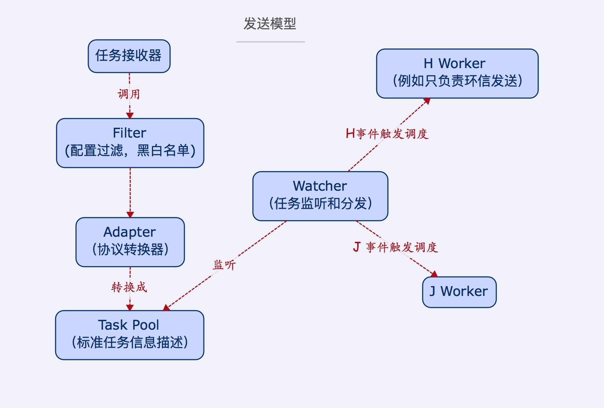

```
(node性能优化二) API粒度实践
2016-01-11 19:10:49
```


>把复杂拆分成简单，将简单组合成强大，再用强大去解决复杂。`--` Unix的设计思想之一

最近在做公司消息中心的重构，是个大坑。老代码会把大批量的任务往内存里面塞入，经常跑着就不知道那里挂了，然后任务也丢失了。
重构主要做了如下几件事
1. API功能单一化（降低API粒度）
2. 将任务队列化并做持久存储，做成消费模型
3. 工作进程之间的相互独立，防止互相干扰。

---
<!-- more -->

> 关于API粒度，粗细各有好处，在这不敢妄下定论，只结合特定场景，给些实践心得。至于如何把握，是经验的积累，不停的摸索，最重要的是弄清场景下的需求。

## I/O 角度上的WEB API粒度
记得以前写web api的时候，在controller层面会要求尽量精简，一般只会做外部参数校验，然后具体功能是对service层的转发，service层包含业务逻辑，会是一些更基础服务的组合。  
这样做的一个好处是，如果service层的功能A需要调用到功能B，无需走网络I/O，可以直接走内存。  

下表是不同 I/O 类型及其对应的开销(摘录自《深入浅出node.js》P48)

| I/O 类型     | 花费的 CPU 时钟周期
| :---         | :---
| CPU 一级缓存 | 3
| CPU 二级缓存 | 14
| 内存         | 250
| 硬盘         | 41000000
| 网络         | 240000000

> 到这里，有一个很有意思的问题，假如我们访问的是 127.0.0.1 那么时钟周期是在什么级别？

---

## API功能单一化（降低API粒度）
一个函数所做的事情越多，那么它出错的概率就越大。  
比如发送操作，最基础的版本是这样的  
`1) 获取要发送的用户` -> `2) 匹配文案` -> `3) 调用第三方推送服务`
但是有一天，产品告诉你，有用户收不到，所以你加了个重试
`1) 获取要发送的用用户` -> `2) 匹配文案` -> `3) 调用第三方推送服务` -> `4) 判断返回，失败重试`  
平稳了一段时间，后来接入的业务多了，发现超过第三方推送服务的频率限制了，于是在（3）处加了个延时，似乎曲线救国了。  
后来，运营来了，我有一个n万的名单要发。。。结果。。。
事实上，真实的推送，比这复杂得多。还得考虑app版本，用户推送设置，多app的证书问题，第三方接口频率限制问题，任务定时，错误怎么处理等~~~

我们无法保证程序是100%可靠的，所以要想办法降低出错后的成本。一个思路是，单个函数只做一件事，单个函数只处理单个任务，不做批量处理，通过并发实现产能的提高（提高并发，其实就是水平拓展）。  

比如拆分后的发送模型

现在的频率限制可以放在右侧的消费 worker 上。  
实际测试中，最后的推送操作事故率是最高的，而任务添加的操作，相比而言是轻量的，通过 Watcher 隔离后，尽量保证业务方的不受影响。

worker 消费任务的时候，每次只取一条，发生未知错误后，worker 会终止运行，这时候需要人工介入。这样做，即使 worker 挂了，大多数任务还在任务池，没有随着内存烟消云散了，排查完错误后，还有得救。

那么定时任务如何实现呢，本着功能单一的原则，不会往发送模型上去加。

订阅列表的出现，是为了解决群发时用户状态遍历耗时的瓶颈。

在这次重构中，API功能单一化，除了降低了出错后的损失外，还为后期的拓展带来了可能性，比如把一个消费worker变成一台机器，就可以实现集群了。

---

## 为什么需要Worker
node 从0.8开始，引入了 cluster 模块，程序员可以借此轻松的创建多进程应用，搭建单机集群。多进程架构除了能够更加高效的利用CPU资源外，还能更好的保证服务可用性。  
对于web服务，我们经常通过 cluster 开启一个主进程和多个子 worker，每个 worker 都拥有完整的功能，然后通过端口复用实现负载均衡。  
由于各个 worker 之间是相互独立的，所以只要主进程没挂，且至少有一个子worker存活，就可以继续提供服务。  
更进一步的做法是，针对每个web api起独立的worker，该worker仅拥有该web api需要的功能，这种更加精细化的操作，就要用到 node 的 `child_process` 模块了,但是 node 官方文档里面有这么一句  

>These child Node.js processes are still whole new instances of V8. Assume at least 30ms startup and 10mb memory for each new Node.js. That is, you cannot create many thousands of them.

所以，这是把双刃剑，一旦 worker 数目失控，不能有效的回收，那就机毁人亡了。  

---

## Worker 管理
本来想写在这里，发现没有示例，容易变成说明书，
打算配合示例，另起一篇，打算说说

* worker 启动和回收
* worker 之间的通信
* worker 之间的隔离
