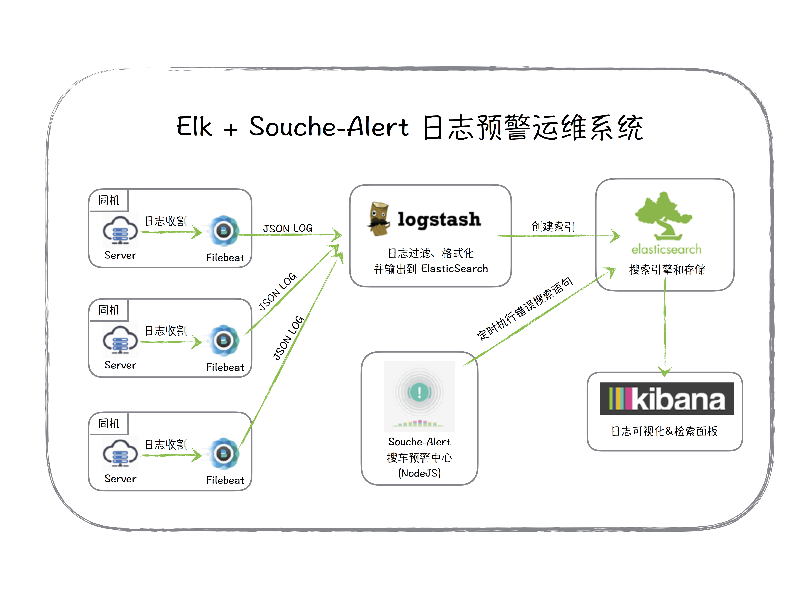

```
node 日志规范化与分析监控
创建于 2016-07-10 12:10:37
```



## 原由
今天7月10号，到8月10号，正好来搜车前端一年。  
刚来这时，还是个 Noder 新手，当然现在也是。那时面对百万行数量级的代码，一旦出个问题又没有错误栈，简直就是梦魇~。当面对线上 bug 时，便是这种窘境，然后本地测试下来，却又是好的，抓狂。  
情急之下，先拿 [sentry](https://getsentry.com/welcome/) 顶了一段时间，项目主要应用如下：  
* 系统未捕获错误记录
* 邮件告警提醒
* 本身也是个优秀的协作平台

就这么熬了大半年，慢慢的也凸显出一些问题，比如：  
* 仅仅是对错误栈的记录，缺少对上下文环境的记录， 对 bug 调试帮助有限。
* 搜索功能相对薄弱，历史可回溯性差。
* 团队开始有日志规范化、集群日志监控的需求，这显然不是 sentry 能做的。  

于是有了 ELK + Souche-Alert 的演进。


<!-- more -->

## ELK
俗称日志分析3剑客，是 Elasticsearch + logstash + kibana 的简称，网上搜到很多关于它们的资料，这里就简要说下几个关键配置，可配合首页图理解作用。

### filebeta 日志收割机
[filebeat 下载地址](https://www.elastic.co/downloads/beats/filebeat) ，无需安装可直接执行 `bin` 命令  
**启动 filebeta**  
```shell
./filebeat -e -c filebeat.yml -d '*'
```
**配置文件**  
* 设置需要监听的日志路径
* 设置 logstash 地址
* 记得确认下 Elasticsearch 的默认配置有没有移除
```shell
filebeat:
  # List of prospectors to fetch data.
  prospectors:
    # Each - is a prospector. Below are the prospector specific configurations
    -
      # Paths that should be crawled and fetched. Glob based paths.
      # To fetch all ".log" files from a specific level of subdirectories
      # /var/log/*/*.log can be used.
      # For each file found under this path, a harvester is started.
      # Make sure not file is defined twice as this can lead to unexpected behaviour.
      paths:
        - /tmp/bunyan-cheniu-error.log
        # - /var/log/*.log
        #- c:\programdata\elasticsearch\logs\*
### Logstash as output
logstash:
  # The Logstash hosts
  hosts: ["127.0.0.1:5043"]
```

### logstash 日志中转站
[logstash 下载地址](https://www.elastic.co/downloads/logstash)  
**启动 logstash**
```shell
./bin/logstash -f config/cheniu.conf
```
**配置 logstash**  
日志格式选择的是 JSON 格式，默认模板会对所有 String 类型的字段做索引和分词操作，这里使用了自定义的模板，指定某些字段，不需要进行索引，以提高 ElasticSearch 的搜索性能 & 节省存储空间。  
```shell
# The # character at the beginning of a line indicates a comment. Use
# comments to describe your configuration.
# filebeats 中的 hosts 配置需要和这里对应，这里选择了对分析最友好的 json log 格式
input {
    beats {
        type => "cheniu_api_server"
        port => "5043"
        codec => "json"
    }
}
# The filter part of this file is commented out to indicate that it is
# optional.
filter {
}
output {
    elasticsearch {
        index => 'cheniu-api-test-%{+YYYY.MM.dd}'
        template => '/home/yourname/logdir/logstash-2.3.2/config/cheniu-api-template.json'
        template_name => 'cheniu-api'
        template_overwrite => true
    }
    stdout {}
}
```
可以在 logstash 的项目内搜索 `elasticsearch-template.json` 看到默认模板。下面是自定义优化过的模板，主要更改在 `properties` 部分。暂时还没有中文分词的需求，如果有的话，需要对包含中文的字段指定分词引擎。
```json
{
  "template" : "cheniu-api-*",
  "settings" : {
    "index.refresh_interval" : "10s"
  },
  "mappings" : {
    "_default_" : {
      "_all" : {"enabled" : true, "omit_norms" : true},
      "dynamic_templates" : [ {
        "message_field" : {
          "match" : "message",
          "match_mapping_type" : "string",
          "mapping" : {
            "type" : "string", "index" : "analyzed", "omit_norms" : true,
            "fielddata" : { "format" : "disabled" }
          }
        }
      }, {
        "string_fields" : {
          "match" : "*",
          "match_mapping_type" : "string",
          "mapping" : {
            "type" : "string", "index" : "analyzed", "omit_norms" : true,
            "fielddata" : { "format" : "disabled" },
            "fields" : {
              "raw" : {"type": "string", "index" : "not_analyzed", "ignore_above" : 256}
            }
          }
        }
      } ],
      "properties" : {
        "name": {"type": "string", "index": "not_analyzed"},
        "req_id": {"type": "string", "index": "not_analyzed"},
        "@timestamp": { "type": "date" },
        "@version": { "type": "string", "index": "not_analyzed" },
        "geoip"  : {
          "dynamic": true,
          "properties" : {
            "ip": { "type": "ip" },
            "location" : { "type" : "geo_point" },
            "latitude" : { "type" : "float" },
            "longitude" : { "type" : "float" }
          }
        }
      }
    }
  }
}
```
### ElasticSearch
[ElasticSearch 下载地址](https://www.elastic.co/products/elasticsearch) ，同样免安装，目前还没有集群需求，所以拿来就能用。

### Kibana
[kibana](https://www.elastic.co/products/kibana) 强大的日志可视化面板，配置下 ElasticSearch 地址后，即可使用。

### Souche-Alert
Elastic 公司有 [watcher](https://www.elastic.co/products/watcher) 的商用产品，嫌配置略繁、灵活性不够 + 收费，自己用 Node 撸了一个告警中心，大概原理是定时调用 ElasticSearch 的搜索 Api，查询错误日志，根据触发逻辑，判断是否需要发送告警邮件。
好处如下：  
* javascript 的技术栈 谁都能上去写几个监控。（我在前端团队）
* 原理够简单粗暴，所以足够稳定，调试也很简单。
* Free！

## Log 的生成约定
针对 [bunyan](https://github.com/trentm/node-bunyan) 团队内部又做了一层封装，做了一个叫做 bylog 的私有 npm 包，用于生成 json 格式的日志。  
做了如下改进：  
* node xx.js | bunyan 命令更改为一个可配置参数，用于日志格式化输出。
* 增加 meta 字段支持，用于记录额外的上下文信息。
* 增加静默通道，日志可选择只输出到文件，用于请求信息的记录。
* 为防止日志索引内出现 name.xxx.cc 的 name 字段，对 json 日志第二层后的数据用 util.inspect 做了最多5层的转义，考虑到性能，不能再多了。

### 框架集成
```javascript
const bylog = require('../');
// 终端输出格式化，做了 node xxx.js | bunyan 的事
const logOutput = require('../lib/log_output.js');

// 支持 bunyan (https://github.com/trentm/node-bunyan) 所有参数
let logOpt = {
    name: 'cheniu-pro',
    src: false,
    streams: [
        {
            level: 'info',
            path: '/tmp/bunyan-cheniu-pro.log',
            mute: true // 只输出到文件，不在终端输出，呼应输出函数 Options mute 参数
        },
        {
            level: 'trace',
            stream: logOutput // process.stdout
        }
    ]
};

let byLog = bylog.createLogger(logOpt);
```

### level 约定
The log [levels](https://github.com/trentm/node-bunyan#levels) in bunyan are as follows. The level descriptions are best practice opinions of the author.

* "fatal" (60): The service/app is going to stop or become unusable now. An operator should definitely look into this soon.
* "error" (50): Fatal for a particular request, but the service/app continues servicing other requests. An operator should look at this soon(ish).
* "warn" (40): A note on something that should probably be looked at by an operator eventually.
* "info" (30): Detail on regular operation.
* "debug" (20): Anything else, i.e. too verbose to be included in "info" level.
* "trace" (10): Logging from external libraries used by your app or very detailed application logging.

**info（含）以上级别日志将被记录到日志平台，level:>=50 日志，会有邮件警告，需要立即处理。**

在项目内，通过如下函数输出不同级别日志，byLog 挂载在 global 对象上。
```javascript
byLog.{level}(err[, meta[, append]]);
- {Error|String}err   Error 对象或者字符串.
- {JSON|String}meta  [可选] 用于记录错误发生时的上下文信息
- {JSON}append [可选] 目前支持如下参数
  - {String}req_id  请求唯一 id，项目内可以从 req.x_request_id 上获取，用于将报错和某次 API 请求绑定
  - {Boolean}mute 默认 false，强制不在终端输出

// 示例 Test
byLog.trace('trace message here');
byLog.debug('debug message here', 'meta message here');
byLog.info('info message here', {infoKey: 'infoValue'});
byLog.warn(new Error('warn message here'), {infoKey: 'infoValue'});
byLog.error(new Error('error message here'), {
    url: 'http://www.souche.com',
    token: {
        from: 'usercenter',
        value: 'jdi90knen'
    }
});
byLog.fatal(new Error('fatal message here'), null, {req_id: 'xxx'});
```

**注意：！并不是所有 Error 都需要 error（含）以上级别，根据影响程度，由开发者自行决定**


## 日志类型
### 错误日志
**收集渠道**  
* 系统未捕获错误，埋点如下，输出级别为 `error`。  

```javascript
process.on('uncaughtException', processErrorHandler);
process.on('unhandledRejection', processErrorHandler);
```
* 程序内 byLog 的输出
* console.error 等于 byLog.error
* 针对 Express 可做如下埋点  

```javascript
// 在所有路由最后，添加错误处理，必须同时含有四个参数
// http://expressjs.com/en/guide/error-handling.html
app.use(function(err, req, res, next) {
    res.send({
        code: 500,
        message: `System Error! Please send serial number ${req.x_request_id} to administer`
    });
    byLog.error(err, null, {
        req_id: req.x_request_id
    });
});
```

### 请求链路信息
bylog 框架内有个中间件，做了如下事情

* 如果请求 `header` 部分未指定 `X-Request-Id`，则系统自动填充格式如 `w{weeks}{day of week}_uuid` 值。  
* 默认记录每次 API 请求的完整参数、头部信息，并在 Express 的 `req.x_request_id` 上绑定本次请求的 `X-Request-Id`。  
* 在 API 响应体 `header` 部分返回 `X-Request-Id` 字段。

在 Express 的实际应用中，我们还对 res.send 函数做了一次 hack，将 json 格式的返回记录下来，并将请求对象通过 `req.x_request_id` 进行进行关联。

> res.send 函数有个暗坑，如果你传一个 json 对象进去，那么函数会先进行一轮类型判断，将 json 转换为字符串后，再次回调 res.send。

最佳实践：  
错误输出的时候传入 `req.x_request_id` 值，将错误和某个请求进行关联。
```javascript
byLog.fatal(new Error('fatal message here'), {key: 'keyValue'}, {req_id: 'xxx'});
```
在日志面板搜索栏输入如下语句，即可将某次请求的所有日志信息聚合查看（注意搜索时候，时间范围的选择）
```shell
req_id: 'w224_9666a363-af8b-4c8a-a5f4-312078763961'
```
测试联调阶段，测试人员抓包后，只需将 `X-Request-Id` 值给服务端人员即可。   
发现线上问题，同理也可看到完整的链路信息。

### 自定义监控逻辑
**针对关键指标，可以通过 ElasticSearch 的日志搜索功能，在Souche-Alert 书写自定义的监控逻辑**

例如队列健康状态监控，关键业务指标，自由发挥。


## 参考资料
* [ELKstack 中文指南](http://kibana.logstash.es/content/logstash/examples/nginx-access.html)  
* [elastic 的产品文档们](https://www.elastic.co/)

## 写在最后的话
日志规范化与分析监控是一个漫长但是有意义的过程，规范化是分析监控的基础，一团乱麻是理不清的。这需要持续的耐心和推动，但是复出总归会有回报的，看着干净的日志输出、能比用户先发现问题，便是满满的愉悦感。  

一些还在内部使用的工具包，向芋头大大咨询下意见，应该很快就能作为一个方案打包开源。  

日志规范化与分析监控，搜车也还有很多路要走，比如  
* 网络 I/O 的监控
* elk 的集群部署
* 日志的清洗和静默规则
* kibana 数据可视化的利用
* 更加多样化的告警渠道，如微信、短信
* 多技术栈的兼容，如 node，java，ruby  
* ...

愿天下没有 P0 bug

PS: 今天我生日
