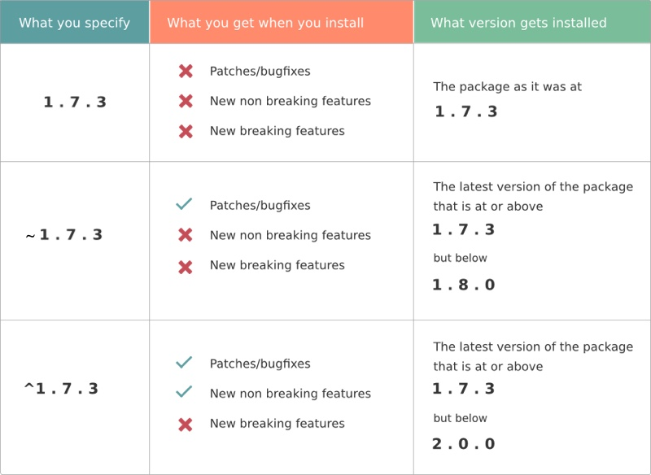

[图解] [Caret Ranges ^1.2.3 ^0.2.5 ^0.0.4](https://www.npmjs.com/package/semver#caret-ranges-123-025-004) 。`^` 符号，是不允许改变最左非零数字，1.x.x 系列见得最多，容易形成误解。正确的升级规则如下：
```
* ^1.2.3 := >=1.2.3 <2.0.0
* ^0.2.3 := >=0.2.3 <0.3.0
* ^0.0.3 := >=0.0.3 <0.0.4
```

> 原文地址：[http://www.plusman.cn/2016/02/23/note-semver/](http://www.plusman.cn/2016/02/23/note-semver/)  
官方网站：[semver 版本管理规范](http://semver.org/)  
原中文译本：[http://semver.org/lang/zh-CN/](http://semver.org/lang/zh-CN/)，基于此整理  
水平有限（真心的），翻译得撕心裂肺，求大神斧正。

---

<!-- more -->

## 语义化版本 2.0.0

### 摘要

版本格式：主版本号.次版本号.修订号，版本号递增规则如下：

1. 主版本号：当你做了不兼容的 API 修改，
2. 次版本号：当你做了向下兼容的功能性新增，
3.   修订号：当你做了向下兼容的 bug 修复。

其他标签，如预发版本、构建元信息，可以拓展到“主版本号.次版本号.修订号”的后面。

### 简介

在软件管理的领域里存在着被称作“依赖黑洞”的糟糕情景，随着软件系统规模的增大，所依赖套件的增多，你就越有可能在未来的某一天发现自己已经焦头烂额。

面对一个拥有复杂依赖的系统，每一次依赖更新都像是一场噩梦。如果依赖包的版本号指定过于严格（译注：参见注解1），可能会面临依赖版本被死锁的风险（必须对每一个依赖手动更改版本号后才能完成某次升级）。而如果依赖关系过于松散，又会极易遇到依赖版本失控（比如为了使用最新版的依赖，而不停的更改项目代码，而这些升级不一定合理）。“依赖黑洞”所导致的版本死锁和版本失控问题，阻碍着项目的平滑升级。

因此，我提议用一组简单的制度规范来约束版本号的设定和增长。这些规则基于（但不局限于）已经被各种闭源、开源码软件所广泛实践的规范。为了让这套规则运作，你首先需要声明一个公共 API 列表，这可以是一个文档约定，或者在代码里只暴露需要开放的功能接口。无论如何，这套 API 的定义需要清晰而且精确。一旦你定义了公共 API，就要保持 API 列表和版本号同步更新。考虑使用这样格式的版本号：X.Y.Z （主版本号.次版本号.修订号），bug 修复且不影响 API 时，递增修订号；API 保持向下兼容的新增及修改时，递增次版本号；进行不向下兼容的修改时，递增主版本号。

我称这套系统为“语义化的版本控制”，在这套约定下，每一次版本号的更新都对应着相应的代码改动。

### 语义化版本控制规范（SemVer）

以下关键词 MUST、MUST NOT、REQUIRED、SHALL、SHALL NOT、SHOULD、SHOULD NOT、 RECOMMENDED、MAY、OPTIONAL 依照 [RFC 2119](http://tools.ietf.org/html/rfc2119) 的叙述解读。（译注：为了保持语句顺畅， 以下文件遇到的关键词将依照整句语义进行翻译，在此先不进行个别翻译。）

1. 使用语义化版本控制的软件`必须`定义公共 API。该 API 可以在代码中被定义或用严谨的文档描述。无论何种形式都应该力求全面和精确。

2. 标准的版本号`必须`采用 X.Y.Z 的格式，其中 X、Y、Z 为非负的整数，且`禁止`在数字前方加前导零。X 是主版本号、Y 是次版本号、 Z 为修订号。每个元素`必须`以数值来递增。例如：1.9.0 -> 1.10.0 -> 1.11.0。

3. 带版本号的软件发行后，`禁止`改变该版本软件的内容。任何修改都`必须`以新版本发行。

4. 主版本号为零（0.y.z）的软件处于开发初始阶段，一切都可能随时被改变。这样的公共 API 不应该被视为稳定版。

5. 1.0.0 的版本号用于标识稳定 API 的发布。这一版本之后，所有的版本号更新都基于公共 API 的修改内容。

6. 修订号 Z（x.y.Z | x > 0）`必须`在只做了向下兼容的 bug 修复时才递增。bug 修复的定义是，修改程序内部行为，使其输出正确的结果。

7. 次版本号 Y（x.Y.z | x > 0）`必须`在有向下兼容的新功能出现时递增。在任何公共 API 的功能被标记为弃用时也`必须`递增。也`可以`在内部程序有大量功能更新或改进时递增。其中`可能`包括修订号的改变。每当次版本号递增时，修订号`必须`置零。

8. 主版本号 X（X.y.z | X > 0）`必须`在有任何不向下兼容的修改被加入公共 API 时递增。其中`可能`包括次版本号及修订号的改变。每当主版本号递增时，次版本号和修订号`必须`置零。

9. 预发版本号`可以`被标注在修订号之后，由一个连接号（译注：-）再加上一连串以句点（译注：.）分隔的标识符号组成。标识符号`必须`由 ASCII 的英数字和连接号 [0-9A-Za-z-] 组成，且`禁止`留白。数字型的标识符号`禁止`添加前导零。预发版的优先级低于相关联的标准版本。预发版本表示这个版本并不稳定，而且可能会和标准版本不兼容。例如：`1.0.0-alpha，1.0.0-alpha.1，1.0.0-0.3.7，1.0.0-x.7.z.92`。

10. 版本构建元信息`可以`被标注在修订版或预发版本号之后，由一个加号（译注：+）再加上一连串以句点（译注：.）分隔的标识符号组成。标识符号`必须`由 ASCII 的英数字和连接号 [0-9A-Za-z-] 组成，且`禁止`留白。当判断版本的优先层级时，版本构建元信息`可以`被忽略。 因此当两个版本只有版本构建元信息有差别时，属于相同的优先层级。例如：`1.0.0-alpha+001，1.0.0+20130313144700，1.0.0-beta+exp.sha.5114f85`。

11. 标识符的优先层级决定不同版本号在比较时如何排序。判断优先层级时，`必须`把版本号依序拆分为主版本号、次版本号、修订号及预发版本号后进行比较（版本构建元信息不在这份比较的列表中）。由左到右依序比较每个标识符号，通过第一个差异值来决定优先层级：主版本号、次版本号及修订号以数值比较，例如：1.0.0 < 2.0.0 < 2.1.0 < 2.1.1。当主版本号、次版本号及修订号都相同时，带预发版本号的比标准版本号优先级低，例如：1.0.0-alpha < 1.0.0。有相同主版本号、次版本号及修订号的两个预发版本号，其优先层级`必须`透过由左到右的每个被句点分隔的标识符号来比较，直到找到一个差异值后决定：数字标识符号以数值高低比较，有字母或连接号时则逐字以 ASCII 码的大小来比较。数字的标识符号比非数字的标识符号优先层级低。若开头的标识符号都相同时，分段比较多的预发版本号优先层级比较高。范例：`1.0.0-alpha < 1.0.0-alpha.1 < 1.0.0-alpha.beta < 1.0.0-beta < 1.0.0-beta.2 < 1.0.0-beta.11 < 1.0.0- rc.1 < 1.0.0`（译注：参见注解2）。

### 为什么要使用语义化的版本控制？

这并不是一个新的或者革命性的想法。实际上，你可能已经在做一些近似的事情了。问题在于只是“近似”还不够。如果没有某个正式的规范可循，版本号对于依赖的管理并无实质意义。将上述的想法命名并给予清晰的定义，能够让你更好的与软件使用者交流。一旦这些设计意图的转达变得清晰，灵活（但又适度）的依赖规范就能达成。

举个简单的例子来展示语义版本是如何解决“依赖黑洞”的。假设有个名为“消防车”的函数库，它需要另一个名为“梯子”并已经有使用语义化版本控制的套件。当“消防车”创建时，“梯子“的版本号为 3.1.0。因为“消防车”只使用了版本 3.1.0 的部分功能， 你可以放心地指定所依赖“梯子“的版本号大于等于 3.1.0 但小于 4.0.0。这样，当“梯子“发布 3.1.1 和 3.2.0 版本时，你可以直接利用你的套件管理系统升级“梯子”，因为它们能与现有的“消防车”兼容。

作为一位负责任的开发者，理当确认每个依赖包是否按照规范升级。但是现实世界是混乱的，我们除了提高警觉外能做的不多。你所能做的就是让语义化的版本控制为你提供一个健全的方式来发行以及升级依赖，而无需为了某个依赖单独更新代码，从而节省你的时间和精力。

如果你对此认同，希望立即开始使用语义化版本控制来管理你的项目。请在你的 README 文件中添加此页链接，让别人也知道这些规则并从中受益。

### FAQ
Q：在 0.y.z 的初始开发阶段，我该如何进行版本控制?  
A：最简单的做法是以 0.1.0 作为你的初始化开发版本，并在后续的每次发行时递增次版本号。

Q：如何判断发布 1.0.0 版本的时机？    
A：当你的软件被用于正式环境，它应该已经达到了 1.0.0 版。如果你已经有个稳定的 API 被使用者依赖，也应是 1.0.0 版。如果你有很多向下兼容的问题要考虑，也应该算是 1.0.0 版了。

Q：这不会阻碍快速开发和迭代吗？  
A：主版本号为零的时候就是为了做快速开发。如果你每天都在改变 API，那么你应该仍在主版本号为零的阶段（0.y.z），或是正在下个主版本的独立开发分支中。

Q：对于公共 API，若即使是最小但不向下兼容的改变都需要产生新的主版本号，岂不是很快就达到 42.0.0 版？  
A：这是开发者的责任感和前瞻性的问题。不兼容的改变不应该轻易被加入到有许多依赖代码的软件中。升级所付出的代价必须是有意义的。要递增主版本号来发行不兼容的版本，意味着你已经为这些改变所带来的影响慎重考虑过，并且评估了所涉及的`成本/效益`比。

Q：为整个公共 API 写文档太费时间了！  
A：为供他人使用的软件编写正确的文档，是你作为一名专业开发者应尽的职责。保证项目高效运转，一个很重要的方面是控制软件复杂度，如果没有人知道如何使用你的软件，或如何安全的调用你的函数，这将很难做到。长远来看，使用语义版本，并坚持定义清晰的公共 API，能够使得项目平滑推进。

Q：万一不小心发布了不兼容的更新，但只更改了次版本号，该如何补救？  
A：一旦发现自己破坏了语义化版本控制的规范，就要修正这个问题，并发行一个新的次版本号来更正这个问题，并且恢复向下兼容。即使是这种情况，也不能去修改已发行的版本。可以的话，将有问题的版本号记录到文档中，告诉使用者问题所在，让他们能够意识到这是有问题的版本。

Q：如果我更新了自己的依赖但没有改变公共 API 该怎么办？  
A：由于没有影响到公共 API，这可以被认定是兼容的。若某个软件和你的套件有共同依赖，则它会有自己的依赖规范，作者也会告知可能的冲突。要判断改版是属于修订等级或是次版等级，是依据你更新的依赖关系是为了修复问题或是加入新功能。对于后者，我认为通常需要写额外的代码，这显然会是一个次版本号级别的递增。

Q：如果我变更了公共 API 但无意中未遵循版本号的改动怎么办呢？（意即在修订等级的发布中，误将重大且不兼容的改变加到代码之中）  
A：自行做最佳的判断。如果你有庞大的用户群，会因为回退公共 API 功能，受到严重的影响，那么最好做一次主版本的发布，即使严格来说这个修复仅是修订等级的发布。记住，语义化的版本控制就是透过版本号的改变来传递信息。若这些改变对你的使用者是重要的，那就透过版本号来向告知他们。

Q：我该如何处理即将弃用的功能？  
A：弃用现存的功能是软件开发中的家常便饭，也通常是向前发展所必须的。当你弃用部份公共 API 时，你应该做两件事：（1）更新你的文档让使用者知道这个改变。（2）发行一个次版本号来标记将要废弃的 API。在新的主版本完全移除弃用功能前，至少要有一个次版本包含这个弃用 API，这样使用者才能平滑的过渡到新 API。

Q：语义化版本对于版本的字符串长度是否有限制呢？  
A：没有，请自行做适当的判断。举例来说，一个长度为255个字符的版本号，已经很夸张。再者，特定的系统对于字串长度可能会有他们自己的限制。

### 关于

语义化版本控制的规范是由 Gravatars 创始人兼 GitHub 联合创始人之一的 [Tom Preston-Werner](http://tom.preston-werner.com/) 所起草的。

如果您有任何建议，请 [open an issue on GitHub](https://github.com/mojombo/semver/issues)。

### 授权

[创作共享 - CC BY 3.0](http://creativecommons.org/licenses/by/3.0/)

---

## 注解
1. [Difference between tilde(~) and caret(^) in package.json](http://stackoverflow.com/questions/22343224/difference-between-tilde-and-caret-in-package-json)
2. [软件版本周期](https://zh.wikipedia.org/wiki/%E8%BB%9F%E4%BB%B6%E7%89%88%E6%9C%AC%E9%80%B1%E6%9C%9F)
