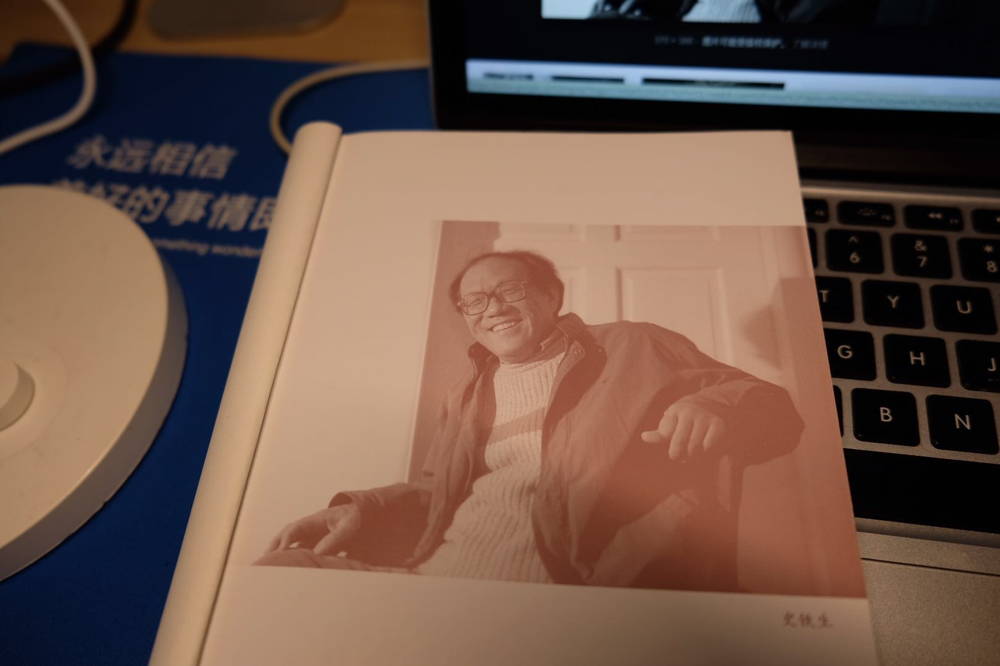

```
2019M2 阅读笔记 
创建于 2019-02-12 14:29:51
```

## 《务虚笔记》| 史铁生
  

从 18.12.01 开始阅读，断断续续也看了 2 个多月，掩卷有思。

《务虚笔记》是在写作之夜写成的，但作者在其中多次描写午后的阳光透过窗户射向墙角，又沿着墙壁折了上去，就像是书本扉页那张照片所诉说的那个午后，不管最后女教师 O 的自杀，还是那个葵林里的女人背负半世“叛徒”的罪名，还是 F 的郁郁而终，史铁生还是留了一丝温存给写作之夜那个子虚乌有的世界。

写作之夜的世界，是一个平行世界，多个世界之间会有交点，如果俯瞰就像一张大网，不同的选择导致走向不同的节点，但造化弄人，无数个差异的选择，可能又使命运汇聚到同一个节点上。

就像 L 最后重逢昔日的恋人，和《死亡序曲》里那个来 O 和 Z 家里吃饭过夜的未知男子，场景是何其相似，但 L 没有选择过夜，命运又走向了另外的岔路。

这个虚拟世界存在的唯一目的是：推演出什么才是爱情？  
爱情会淹没于权利的博弈，会淹没于与生俱来的不平等，会被世俗的道德（其实是自私，比如“叛徒”这个词）所禁锢，也可能会被时势（比如政局动荡）割裂得天各一方。  
爱情什么也不是，爱情又是一切，是 O 生的意义，是 F 的一夜白头。  
爱情哪都不在，又玻璃心，但只要每一对恋人还是渴望着它，追寻着它，它又情比金坚。

以前只看过史铁生的《我与地坛》、《合欢树》，对他的印象仅限于一个坚强、温暖的人；现在，他还应该是的一个感情充盈的人，就像诗人 L，或者写作之夜的每一个人男人，都是史铁生思考过的人生。


## 算法面试通关40讲
最近开始担当面试官，按照团队现有的技术能力模型，如果面试者专业领域知识贮备较少的话，会着重考察下数据结构和算法方面的积累，这也是最能体现学习能力方式了。一个基础知识扎实的程序员，日后也能走得更远。  
想要和面试者对这些知识点能如数家珍般到来，对面试官自身也是提出了更高的要求，愿与君共勉。

= = 二月效率不行啊~~