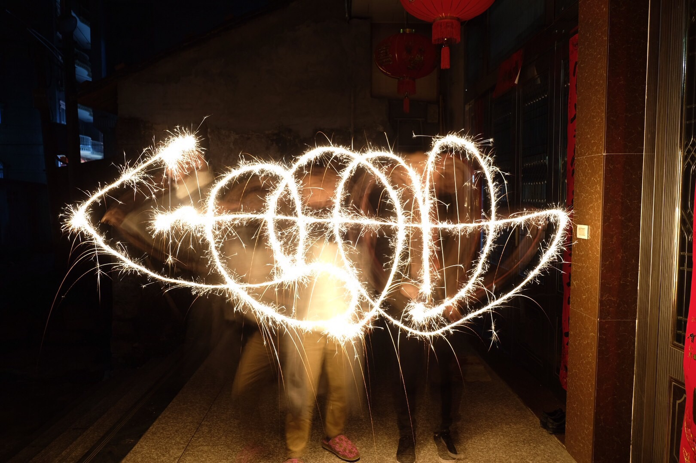
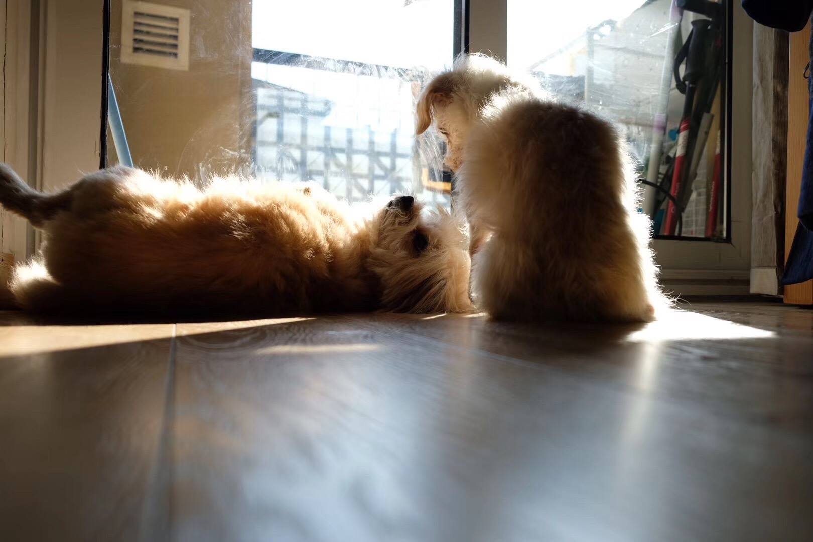

```
2018 总结-跃迁
创建于 2019-02-12 18:11:20
```


”跃迁“ 在物理里指的是：原子中价电子从一个能级或因吸收能量而迁移到更高能级、或因释放能量而迁移到更低能级的过程。或者说，从一个运行轨道跳跃至另一个运行轨道的过程。于我的主观感受是，从一个舒适区跃迁到了另一片充满挑战之地，进入了两个新的角色。

!>这个世界上少了一个男朋友，多了一个丈夫  

2019年1月31号，和小舒蕾领证啦，从此就要担当起家庭责任啦。  
这真的是一段奇妙的旅途，18年1月9号才牵起的手，遇上对的人，时间像是开了10倍数，一晃就是一个时代。  
现在再去回想过去一年的点点滴滴，平淡而又温馨吧，两个人在一起三观相合真的很重要。  
几件事，领证那天其实有好几些不愉快的事情，比如舒蕾的婚假是不能分开请的，本想把 3 天婚假放在春节假期首尾，结果只用上了1天，另外两天白白浪费了；晚上去 SAM 买东西，碰上一帮不讲理抢车位的；后来买衣服花了很久时间，晚饭也没有吃。  
真的很丧的一天，但两人也没有因此吵起来，互相鼓鼓气（类似下图），明天又是好心情。  


舒蕾经常双手握于胸前，类似这小男孩，说：恩！我可以做到的！  
两人在一起，气场中总是充满了正能量，日子久了，你会相信岁月静好，有啥不顺，统统拿下就可以了。  



谈到生活，总是避不开家里的两只狗子，18年小家伙们都很健康。狗子除了给了我们陪伴，每晚一起遛狗的时间，也是繁忙的工作之余宝贵的沟通交流时间，我们会谈谈今天的所见所闻，畅想下新家该如何装修，假如闹不愉快了，也是个很棒的和解时间。

19 年底，我们的小窝就要交付了，一起攒钱，一起设计/装修新家的过程，一定很美妙。

!>少了半个二流程序员，多了一个三流管理者，但这也是冲锋的号角

最近看到邱岳给《跃迁》一书写的序，有一段深表赞同，摘抄如下：  
>当我们作为程序员负责产品、运营相关的工作时，主要是为事务负责。而晋升为管理者后，就要开始为团队负责。一个人很难通过积累对事务负责的经验来学会如何为团队负责，这也意味着成为管理者的道路通常不是按部就班的渐进，而是焕然而至的跃迁。  
所以对我们来说，晋升不是胜利的凯哥，而是冲锋的号角，我们需要大量有意识的学习、反省、改进，才能够抓住机会，成为合格的管理者。

上半年，虽然已经开始带团队，还是很多事情还是忍不住去插一手，写几行代码，似乎这样心里会踏实些，但这一方面会让组员感受不到自己的成长，自己也会没有时间去关注更加重要的东西，比如和需求跟进、团队规划、资源协调。

痛定思痛，下半年选择信任和授权，像信任自己一样信任你的队友，让队友感受到这就是你自己的项目，你就是这个项目的主人。  
除了信任之外，我们还要学会尊重，尊重有两个层面，首先肯定个人已有的成绩，更重要的是，相信并持续的帮助队友发掘出自身更大的价值。  
面对面试者，尊重应体现在：面试的出发点应是去挖掘一个人的闪光点，而不是去挑刺，不过面试者的行事方式能否和团队相容，也是会被重点关注的。  
越来越感受到 CodeReview 的重要，比起忍不住插手写几行代码，和同事面对面的 Review 代码，更能发现问题，更能提升双方的编码水平，而这本身也是一个可拓展的模式，不会说最后出现单点瓶颈。  

在这个新的角色上，可能还略显稚嫩，所以 19 年要抓住自身和团队的执行力，选择信任，选择共同学习成长。


!>遗憾：没能有一次长途旅行

年初的时候，提起过要去一趟日本，可因为一堆杂七杂八的事，最后没有成行；19 年一定要有一次长途旅行啊！