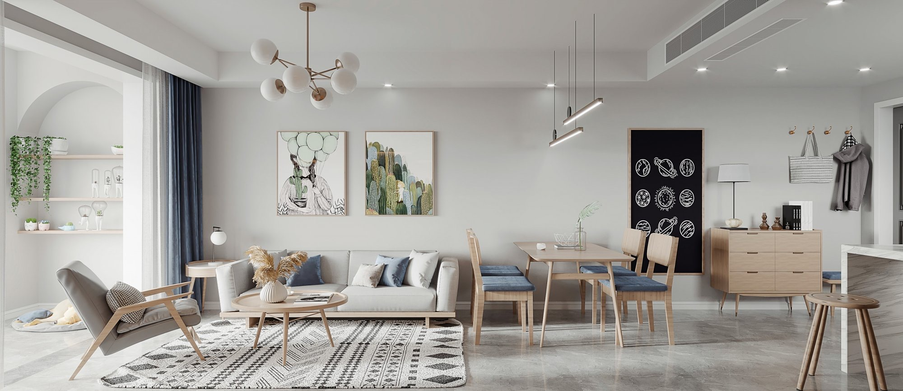
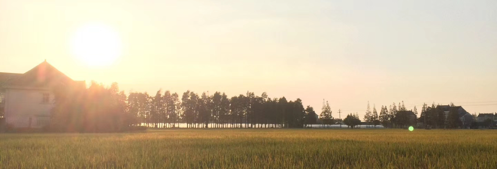

```
2019 总结-痴迷
创建于 2020-02-08 19:52:24
```


今年自从看了米哈里的《心流》之后，问自己最多的问题是：“如何能够全身心的投入一件事情，达到忘我的程度，不畏首畏尾，内心自有宁静的次序？”

!>财富自由并不是你拥有超过多少数额的金钱，它是个相对值，当欲望小于经济能力的时候，你便自由了。

今年 11 月底房子终于交付了，和舒蕾 8 月份开始就提前张罗装修的事情，岳父母主张找熟人，但我们更相信市场一些，走正规合同、正规保修，最后选了圣都。不难理解温州人更愿意找熟人办事的逻辑，老一代温商出门经商，人生地不熟，资金和市场资源都得靠小圈子互相帮衬。  
回到装修上来，我们的理念是：尽量增加公共交流空间  
* 大胆的选择了开放式厨房
* 次卧没有选择把阳台包进来，于是有了十来平方的大阳台
* 一个卫生间，主卧做了衣帽间
* 全屋零线，智能家居搞起来
* 舒蕾还在阳台设计了一个小拱门，下面有属于两只狗子的新窝
* 全屋中央空调、中央新风，因为杭州的未来很长一段时间内的空气质量，对于鼻炎患者来说，不舒服的，同时也为了能拥有一个更加安静的室内环境。

对于新家，小两口还是倾注了很多精力和金钱进去，原定装修工期是 20.5 月份完工，但开年遇上了武汉肺炎疫情，工地复工日期暂未知，安全第一，好事多磨。

若给现在的经济水平一个评价，应在温饱之上，且低欲望，小两口对什么奢侈品之类完全没兴趣。假若日后做事少些生存压力，少些功利驱逐，是不是能更听从内心的声音，能以旁观者的角度去深入思考问题的本质是什么

!>P7 以前就像拿着地图打怪，有的放矢，到了 7 变成告诉你一个目标，然后你要穿越一片未知的森林；再往上，大概去哪都要自己找了吧。



和舒蕾日常会念叨，我们 35 岁后，回家种田吧，也时常会当玩笑和朋友说起。说多了，事情便也当真了。开始盘点资产状况，多久能把债务还清；回到乡下后，靠什么营生；有什么一直想做还没做的事情；乡下的房子一定要带一个小院子，宜家风；将来万一有了孩子，希望 TA 成为一个什么样的人，该如何去教育；  
关于兴趣，舒蕾今年报了个绘画班，也颇有点天赋，彩铅临摹得栩栩如生，而我吉他依旧没练出啥苗头。  
虽说嘴里念叨着田园生活，但夫妻俩毕竟也都是理科生，工作起来还是天然爱较真，内心摸不得鱼。  
像现在做面试官看人的时候，对人品会放在很重的位置，类似 “乡愿” 之流，最为可怕。

大约的确今年 8 月左右，晋升到了 P7，还在适应角色要求的转变。近来，也在想一个问题，工作可以有两种状态：
* 以下一个职级的要求为目标，进行工作规划
* 跳脱个人得失之外，去嗅探公司内外的问题，以己之力能做些什么

事实上唯一不变的是变化，可以长期参考的是品质，自驱有担当，持续精进的品质才能走得更远。所以，也大可做个脱俗之人，试着以第二种状态工作一段时间，谓之工作之心流。

!>为什么可以连着打 4 小时《塞尔达》，而很难连着看 4 小时书。

有一种说法是：游戏有持续反馈，可以让大脑从生理和化学上，产生瘾。古之成大学问者，钻研起学问来，估计也和现代网瘾少年一个劲吧。  
所以良师益友显得弥足珍贵，良师可以在萌芽阶段，帮你设计合理进阶节奏，挑战下自己，能收获些成就感（反馈）；而益友，你前我后，互相鞭策（反馈），进阶之路虽仍旧布满荆棘，但也妙趣横生。  

一个好游戏，其实是有一个完整世界观的，现实世界的宏大，可以在游戏里找到缩影。
* 假如卡关了，能否轻易看攻略？现实世界每个人都有一个剧本，不存在一个上帝视角，可以在你遇到困境的时候，直接给你指出明路；因此，我们会彷徨焦虑。
* 为什么会卡关？一个好游戏，他的元素呈现是统一的，是遵守设计者约定的基础规则的。假如没有上帝视角，直接告诉你问题的答案。那么我们要做的是熟悉游戏世界的基础规则，对这些规则了解的越基础、越底层，最后能解决的问题就越宏观、越复杂。生活中也是，比如解题，你看了 100 个同类问题的答案，却不了解它的原理，那么第 101 个问题，你依然无法靠自己做出来。
* 为什么会有真·卡死？宏观问题，可以由几个基础规则组合得到解；但基础规则，比如水克火，假如你真的不知道，可以实验瞎蒙，或有表象去总结背后原因，但这对时间和精力的要求甚高，有时候还要靠些运气。于是一些好游戏会很贴心在游戏中设置引导环节，像现实中中，会有人生导师那样，告诉你这个世界的基本法则。

今年开始更愿意去看些讲社会法则、技术原理的书，相比直接告诉你答案的快餐书，心中笃定的从前者中才能看到生活的未来。还记得有如下几本：
* 米哈里《心流》
* Ray Dalio 《原则》
* 薛兆丰 -《薛兆丰今经济学讲义》
* 林语堂《苏轼传》，更喜欢他的英文书名《The Gay Genius》，别误解，这书写于 20世纪30年代，Gay Genius 指生气淋漓、豁达幽默
* 极课时间/王争《数据结构与算法之美》、《设计模式之美》
* 李宗吾《厚黑学》

学习之中，敲代码时，偶尔也有沉浸之感，希望 2020 年能更静下心来吧。


>写给未来自己的文章，当作每年的一个快照，一年度的自我访谈，无所谓好坏。

2020 年 5 月之后，在杭州的属于小俩口的安心之所就该有温度了吧。哈哈，期待！