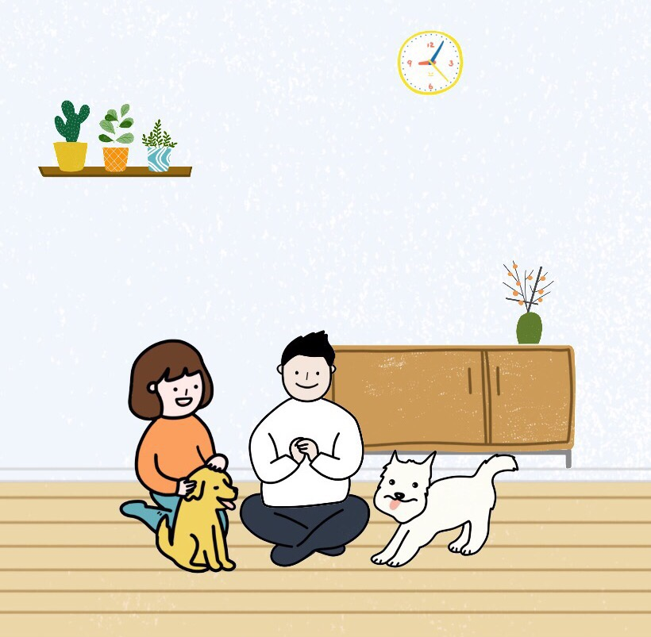

2018.1.2 号的时候发了这么一条朋友圈，“恩，农历新年再写 17 总结，1月份也可以发生很多事”。
确实，在丁酉年的尾巴上，我碰到了让我义无反顾的女孩子，接回了分别半年的狗子小北，工作上也终于升P了。

有个观念，生活和工作不可能是完全分开的，两者是一个不断磨合的过程中，这不仅仅是你一个人的事，还需要陪伴在你身边那些人的理解和宽容。
所以这里不想以工作和生活作为两段分别展开，而是以时间线，讲述两者的冲突和融合。

回到 17 年初，那时候欠了2016一篇总结，现在简单补上，那时候工作一年半，所在的公司已经从 16 年中上旬的困难时期走了出来，在 10 月上线了弹个车，引领了新一波的汽车金融浪潮，一切都在往好的结果发展。在 16 年那段人心惶惶的时期，也曾动摇过、迷茫过，庆幸自己最后还是选择了坚持下来。记得当时有人说：“最后，你会后悔现在的决定的”，我想，不管做了什么决定，只要于心无愧，用心去做就行了，事后的沾沾自喜或者后悔莫及，都是病态的表现。16 年有点宅得可怕，除了元旦那会去了趟成都和重庆，接下来的一整年，都没出去透过气。我和她都各自忙着自己的工作，忽视了很多生活，情感上渐行渐远。转眼到了16年底，到了该写年末总结时候，可那时候回过头去看，似乎看不到未来，心性还未脱校园的稚气，也不懂得该如何爱一个人，一切都似乎是畏手畏脚，末了罢了，先欠着吧。

17 年过年回来，经历了组织架构调整，被调整到了无线架构部，开始认真思考自己的工作方式和知识架构体系。
经历部门调整后，会有专门的时间去思考消息中心的发展，那时候进行开发的时候出发点很简单：

* 稳定可控
* 保证性能
* 可快速迭代
* 交互友好，自动化（用 18 年的规划来说，是工具化）

后来完成了消息运营后台搭建、短信系统重构、几次推送存储的性能升级。当然还欠了一些债，比如可交互式文档，完善的消息链路跟踪，还有一个可以快速迭代、模块化的开发框架（这方面还是会选择去拥抱社区），这些 18 年会还上的。  
也开始思考如何去做一个合格的 PM 了，扪心自问，直到最近一个项目的 PM 角色，我都不好意思给自己一个及格分。
消息不是一个组织架构，所以没有一些强约束，它更像是一个长期项目，功能又是服务于业务方，所以开发的时候会涉及到很多跨部门的资源协调。
今年好多时候，虽然作为 PM，还是去以极客的思维考虑问题，过份相信个人能力能够 cover 住意外情况，没有从开发资源上去做风险规避。
18 年，要多做些任务细分，学会对结果负责，而不是过程。

17 年，不再刻意强调自己是 Node.js 工程师，记得毕业那会，在公司大群里给自己的备注是“node-xxx”，如若不是要成为一个语言专家，对于他人来说，更关注的是你擅长的领域，比如网络编程，分布式系统，而不是你精通某门语言。抱着这个想法，在日常的学习中，开始接触一些网络编程，前端方面的知识，能反哺于自己所服务的领域，当然，现在也愿意去学习点 Java，了解这位服务端霸者的生态体系，收获颇多。

17 年 2-3 月份，花两个月时间开挂似的写了 [im.js](https://github.com/im-js/im.js)，这是一个基于 `react-native + mobx + socket.io + node` 的仿微信 JS-Wechat，虽然项目最后没能落地到实际的业务项目中，但是收获了人生第一个 300+ 星星的项目，期间积累的前端和网络编程方面的知识，在日后项目中，也帮了自己不少忙。事后回头看，那真是一段激情燃烧的岁月啊，每天写到凌晨2点多，都没有半点困意，第二天照常上班。而在这之后，一直想在找回这种专注和热情。

是的，你会发现 17 年开始后，缺失了什么，没有了情感。那时候和她已经谈了有 4 年多，似乎到了那么个岔路口：要么更近一步，领证结婚；要么，给双方一个新的可能；虽然双方因为舍不得 4 年的光阴，那时候也一起开始着手买房，各种限购政策也是不停地阻拦着这个计划；但离那个档口越近，我们越发感到了害怕，她也说过，我不是她喜欢的类型，而我也不再对她有多少留恋，还没结婚就没有了爱情的婚姻，不会是一个美好故事的开始。在 5 月下旬的时候，两人和平的选择了结束。狗子小北，由她带着。

在那之后，我经常说起一个词“爱无能”，我不知道自己该如何真正的去喜欢一个人，如何让一个人接受最真实的你。  
17 年的后半年，用别人的话来说：“你这是浪得飞起来”，每到周五，同事总会开玩笑的问起：“你这是又要去哪浪啊？！”

* 参加各种户外活动：瀑降，滑翔伞，徒步，几乎每个周末都不在家或者约朋友来开趴。
* 7月份买了人生第一套房子，89平的小窝
* 8月份买了人生第一辆车，骚气的蓝鸟
* 10 月份去了一趟心心念的新疆，感受人类的渺小，以及大口吃肉。

然而，一阵狂欢和逃避后，是 “越过山丘 才发现无人等候” 的怅然。  
后来，也接触过几个女生，也都很快的无疾而终，爱不起来。  
后来问过别人两个问题：  
Q：一个人应该是个完整的圆嘛，那样就不需要对方契合什么了？  
A：没有答案，但是你不可能一辈子做别人。  
Q：怎么样才算爱上一个人？  
A：当你愿意为她义无反顾的时候。  

本以为生活就是如此啦，可在 17 年的尾巴上，她出现了。  
突然有一天她对我说，她想养狗，于是元旦前我们跑到上海大姐家，领养了“莫奈"。  
和她接触多起来后，内心惊叹，从未见过如此敢爱敢恨之人，很酷，很善良，充满正能量。  
于是，无可救药地喜欢上了她，在 18.1.9 那天，我们开始谈一单几十亿的生意（医学术语），而我，也成为了她文中的“对象”。  
后来我似乎懂了什么叫做义无反顾，愿意毅然决然的为了一个人从城西搬到滨江，只为住得离爱情近些。  
而她工作再忙，稿子欠得再多，心里还是会有爱情。

按照“峰终定律”，我应该最后再写工作的。

>题图：感谢狗子小北 4 年的陪伴，以及硬汉小干带着莫奈出现在我生命中，我愿用尽一生去守护你们。

说着“今夜月色真美啊”佳楠  
2018-02-13 23:28:22