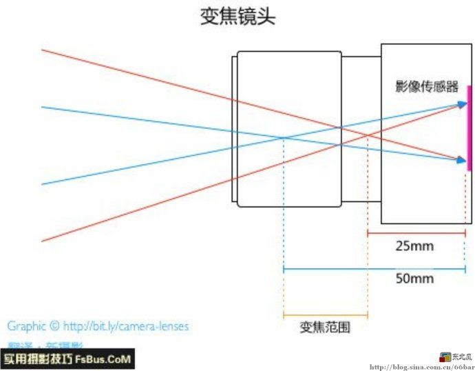

```
SayHello
创建于 2019-01-08 00:07:12
```
微博一直关注着笑笑同学啊_和姬晨在路上，特别喜欢他们的如何拍摄女朋友系列，很生活，很逗逼。  
所以在想啊，摄影不仅仅是光与影的艺术，对于平凡的人来说，也是一种生活态度，平凡的生活也有不一样的精彩。  
2019 的一个小目标是学会摄影，不求技艺精湛，但求不错过生活中每一个温暖的时刻，那就从此刻开始记录我们的生活的吧。  
你的小米照片打印机 🖨 已经在路上啦！！（真香系列，前几个月还说再也不买小米的产品了）

入门教程参照的是知乎 [新手如何系统性的学习摄影？ - 派叔的回答 - 知乎](https://www.zhihu.com/question/36095338/answer/281464153) 的问答，相机是女票的富士 X-E3。


## 基础入门
**先学会光圈优先，和快门优先。配合曝光补偿使用。（解决曝光问题）**  
参阅 http://fujifilm-dsc.com/zhs/manual/x-e3/taking_photo/shooting_mode/index.html


**ISO 感光度设置问题**  
v高感光度会形成噪点，过低的感光度会降低动态范围，新手建议使用 Auto档，设置默认感光度 200 和最高感光度限制，让相机自行调整，X-E3 支持存储 3 个预设自动模式

**焦距原理**  
原文：https://zhuanlan.zhihu.com/p/30620466  

一图胜千言  


**光圈值**  
如果你用一支焦距为50mm的镜头拍摄，光圈为f/2.0，这就意味着开孔的直径是25mm（译注：应该是入瞳直径为25mm，并非光圈的物理直径）。怎么得到的？50/2=25。类似的，如果你用f/4.0光圈拍摄，孔径就是50/4=12.5mm。  
光圈越大，虚化效果越好，景深越小

这里有个有趣的玩法，通过在镜头前遮罩比光圈小的透光孔，虚化的远景灯光可以呈现成透光孔的形状。  
[如何拍出爱心形状](http://www.360doc.com/content/14/0303/22/15804513_357486008.shtml)  


**快门问题**  
想要拍清楚运动的物体，一般快门速度要在 1/500 以上；如果想让运动的物体拍成一个运动轨迹，那就用慢门，一般在 1/8 秒以上；高速快门的定义在 1/1000 以上。  
在高快门速度下，设置连拍往往能够抓拍到意想不到的好照片，X-E3 设置参考 [连拍（连续拍摄模式）](http://fujifilm-dsc.com/zhs/manual/x-e3/taking_photo/continuous/index.html)  
还有一个问题是，在使用慢门的时候，也就是长时间曝光时，在白天（光线充足时）我们要使用到中灰镜（ND滤镜）减光。